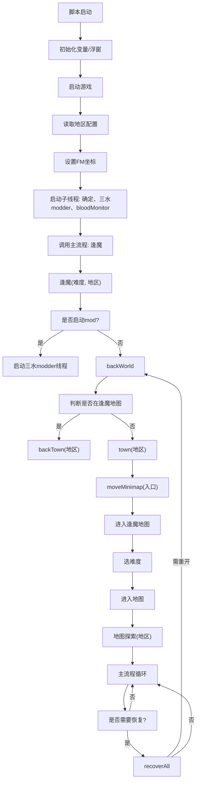
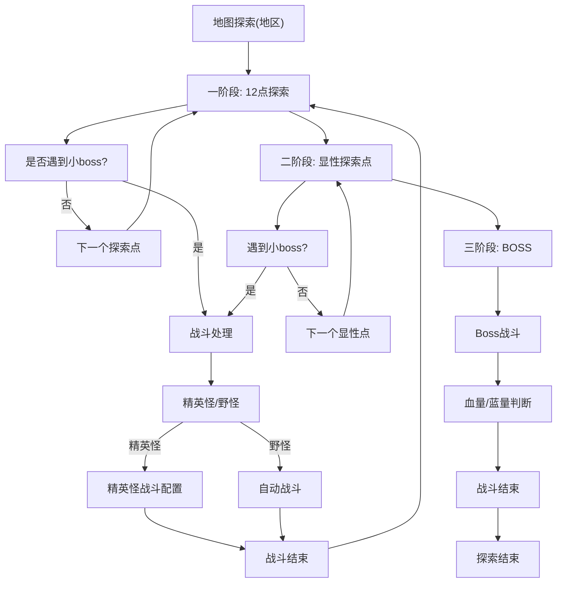
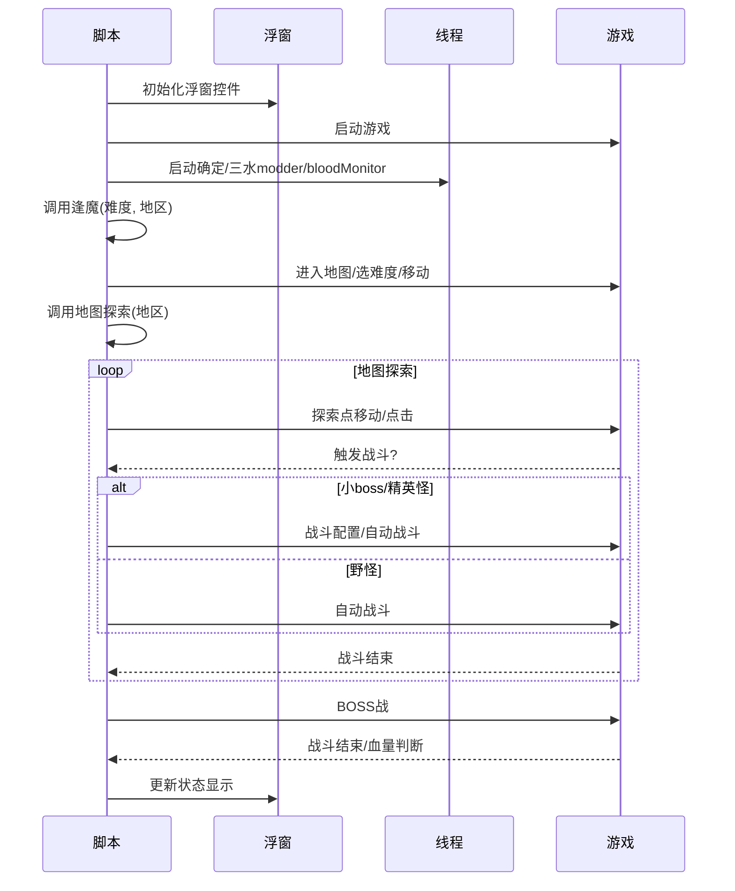

# 1.vb 脚本流程图与时序图

## 1. 主流程流程图

```mermaid
flowchart TD
    Start["脚本启动"] --> Init["初始化变量/浮窗"]
    Init --> StartGame["启动游戏"]
    StartGame --> SelectArea["读取地区配置"]
    SelectArea --> FMSet["设置FM坐标"]
    FMSet --> ThreadStart["启动子线程: 确定、三水modder、bloodMonitor"]
    ThreadStart --> MainCall["调用主流程: 逢魔"]
    MainCall --> OM_1["逢魔(难度, 地区)"]
    OM_1 --> OM_ModCheck["是否启动mod?"]
    OM_ModCheck -- 是 --> ModThread["启动三水modder线程"]
    OM_ModCheck -- 否 --> OM_BackWorld["backWorld"]
    OM_BackWorld --> OM_CheckMap["判断是否在逢魔地图"]
    OM_CheckMap -- 是 --> OM_BackTown["backTown(地区)"]
    OM_CheckMap -- 否 --> OM_Town["town(地区)"]
    OM_Town --> OM_MoveMinimap["moveMinimap(入口)"]
    OM_MoveMinimap --> OM_Enter["进入逢魔地图"]
    OM_Enter --> OM_ChooseLevel["选难度"]
    OM_ChooseLevel --> OM_EnterMap["进入地图"]
    OM_EnterMap --> OM_Explore["地图探索(地区)"]
    OM_Explore --> OM_Loop["主流程循环"]
    OM_Loop --> OM_Recover["是否需要恢复?"]
    OM_Recover -- 是 --> OM_RecoverAll["recoverAll"]
    OM_RecoverAll -- 需重开 --> OM_BackWorld
    OM_RecoverAll -- 否 --> OM_Loop
    OM_Recover -- 否 --> OM_Loop
```

## 2. 地图探索流程图

```mermaid
flowchart TD
    ExploreStart["地图探索(地区)"] --> Phase1["一阶段: 12点探索"]
    Phase1 --> FightCheck["是否遇到小boss?"]
    FightCheck -- 是 --> Fight["战斗处理"]
    FightCheck -- 否 --> NextPoint["下一个探索点"]
    Fight --> FightType["精英怪/野怪"]
    FightType -- 精英怪 --> EliteFight["精英怪战斗配置"]
    FightType -- 野怪 --> AutoKill["自动战斗"]
    EliteFight --> FightEnd["战斗结束"]
    AutoKill --> FightEnd
    FightEnd --> Phase1
    NextPoint --> Phase1
    Phase1 --> Phase2["二阶段: 显性探索点"]
    Phase2 --> Phase2Fight["遇到小boss?"]
    Phase2Fight -- 是 --> Fight
    Phase2Fight -- 否 --> NextVisible["下一个显性点"]
    NextVisible --> Phase2
    Phase2 --> Phase3["三阶段: BOSS"]
    Phase3 --> BossFight["Boss战斗"]
    BossFight --> BossCheck["血量/蓝量判断"]
    BossCheck --> BossEnd["战斗结束"]
    BossEnd --> ExploreEnd["探索结束"]
```

## 3. 主要时序图

```mermaid
sequenceDiagram
    participant Script as 脚本
    participant FloatWin as 浮窗
    participant Thread as 线程
    participant Game as 游戏
    Script->>FloatWin: 初始化浮窗控件
    Script->>Game: 启动游戏
    Script->>Thread: 启动确定/三水modder/bloodMonitor
    Script->>Script: 调用逢魔(难度, 地区)
    Script->>Game: 进入地图/选难度/移动
    Script->>Script: 调用地图探索(地区)
    loop 地图探索
        Script->>Game: 探索点移动/点击
        Game-->>Script: 触发战斗?
        alt 小boss/精英怪
            Script->>Game: 战斗配置/自动战斗
        else 野怪
            Script->>Game: 自动战斗
        end
        Game-->>Script: 战斗结束
    end
    Script->>Game: BOSS战
    Game-->>Script: 战斗结束/血量判断
    Script->>FloatWin: 更新状态显示
```

---

> 本文档基于 `学习资料/1.vb` 脚本自动生成，涵盖主流程、地图探索、主要线程与时序关系。 