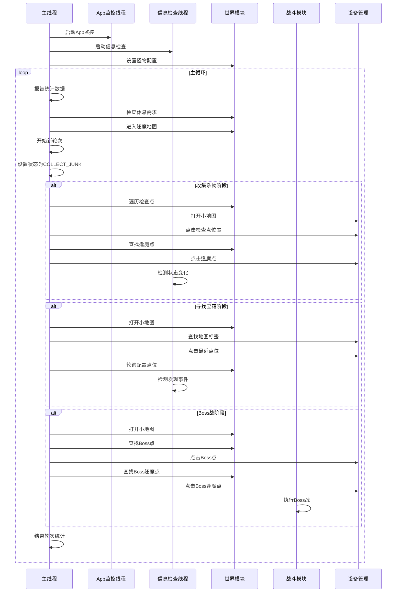
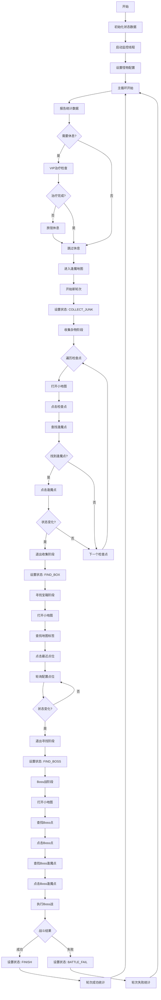
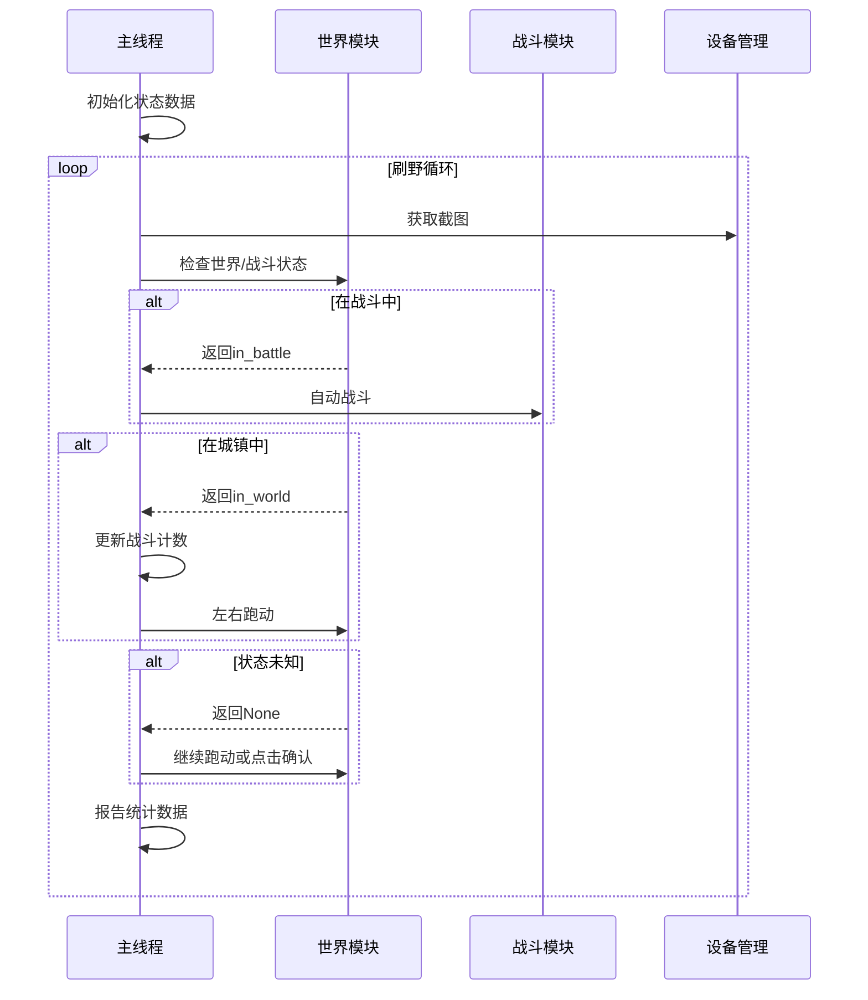
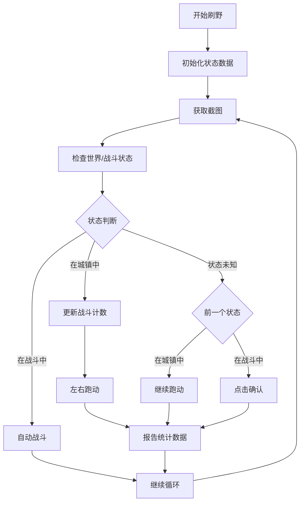
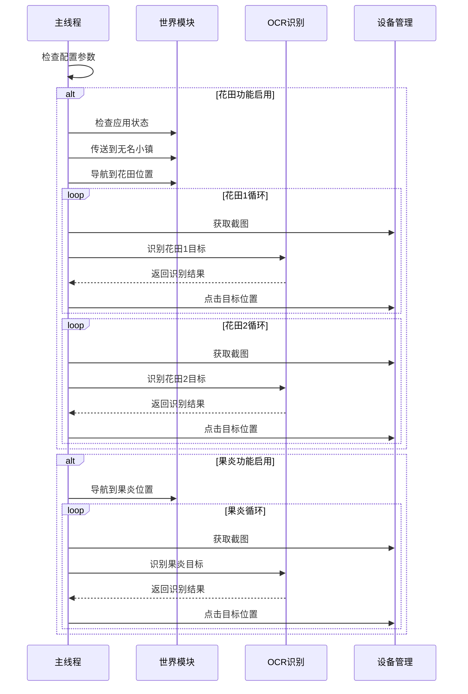
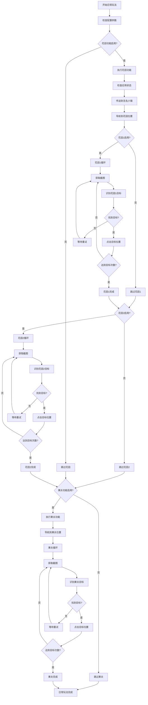
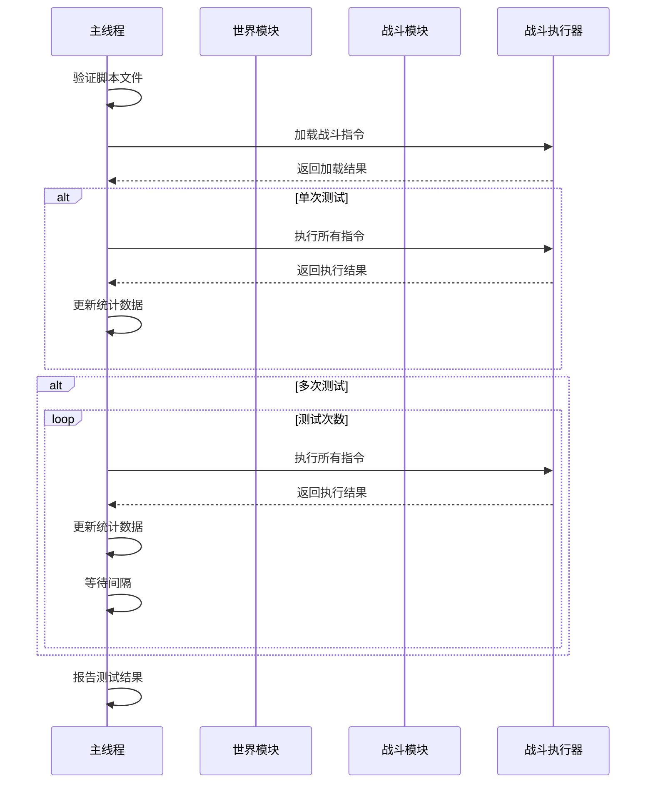
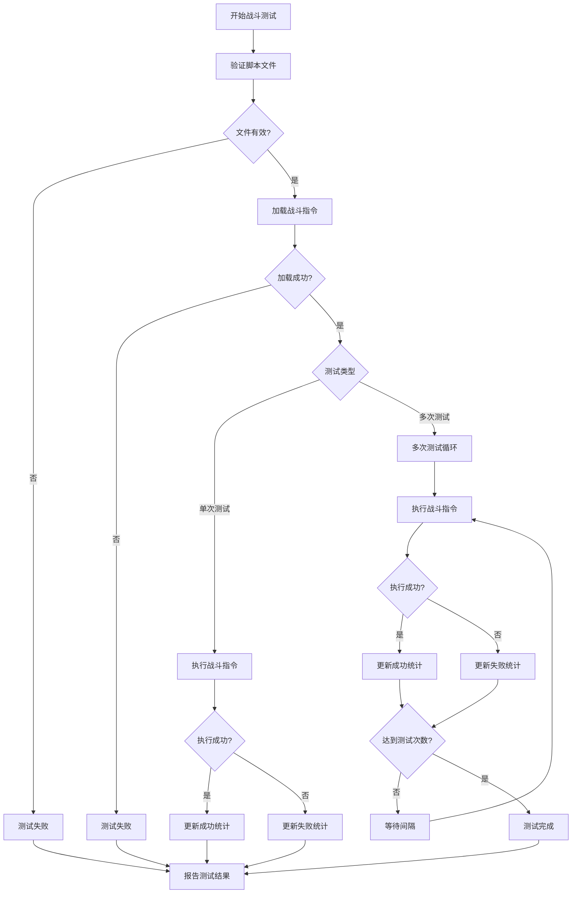
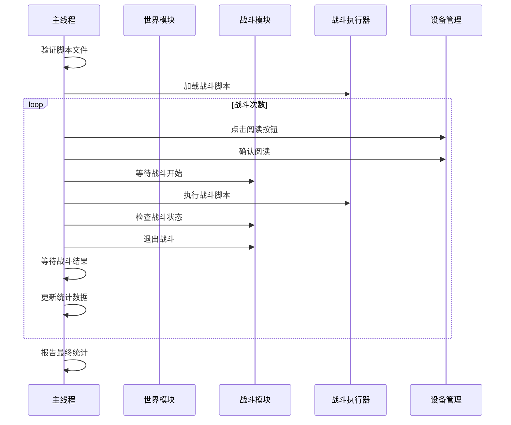
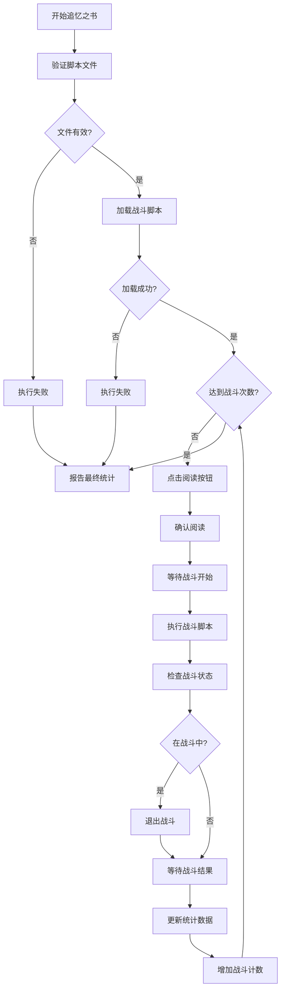

# 玩法流程分析文档

## 概述

本文档详细分析了项目中所有玩法模式的业务流程，包括时序图、流程图和关键业务逻辑。这些分析结果将作为后续优化的参考基准，确保在优化过程中不会破坏核心业务逻辑。

## 1. 逢魔玩法流程

### 1.1 状态机设计

逢魔模式使用8个状态来管理整个流程：

```python
class Step(Enum):
    UN_START = 0      # 未开始
    FINISH = 1        # 完成
    COLLECT_JUNK = 2  # 收集杂物阶段
    FIND_BOX = 3      # 寻找宝箱/怪物/治疗点阶段
    FIND_BOSS = 4     # 寻找Boss阶段
    FIGHT_BOSS = 5    # 战斗Boss阶段
    BATTLE_FAIL = 6   # 战斗失败
    State_FAIL = 7    # 状态失败
```

### 1.2 时序图



### 1.3 流程图



### 1.4 关键业务逻辑

#### 收集杂物阶段 (`_collect_junk_phase`)
1. **检查点遍历**: 按顺序遍历配置的检查点
2. **小地图操作**: 打开小地图，点击检查点位置
3. **逢魔点查找**: 在当前区域查找逢魔点
4. **状态检查**: 检查是否在城镇中或遇到战斗
5. **回退机制**: 遇到战斗时回退到上一个检查点

#### 寻找宝箱阶段 (`_find_box_phase`)
1. **地图标签识别**: 识别小地图上的宝箱、怪物、治疗点标签
2. **最近点位计算**: 计算距离最近的检查点
3. **点位轮询**: 按配置顺序点击各个点位
4. **状态监控**: 监控是否发现目标

#### Boss战阶段 (`_find_boss_phase`)
1. **Boss点查找**: 在小地图上查找Boss点
2. **Boss逢魔点**: 查找Boss的逢魔点
3. **战斗执行**: 执行Boss战斗
4. **结果处理**: 处理战斗结果

### 1.5 线程协作机制

#### 主线程职责
- 流程控制和状态管理
- 设备操作和点击
- 统计数据处理

#### 子线程职责
- App存活监控
- 屏幕信息检查
- 状态变化检测

#### 线程安全机制
- 截图缓存管理
- 状态数据安全访问
- 资源清理机制

## 2. 刷野玩法流程

### 2.1 状态设计

刷野模式使用简单的状态切换：

```python
@dataclass
class FarmingStateData:
    app_alive: bool = False
    in_map: bool = False
    battle_count: int = 0
    last_time: float = 0
```

### 2.2 时序图



### 2.3 流程图



### 2.4 关键业务逻辑

1. **状态检测**: 通过截图分析判断当前状态
2. **自动战斗**: 在战斗中自动执行战斗流程
3. **跑动机制**: 在城镇中左右跑动寻找敌人
4. **计数统计**: 记录战斗次数和挂机时间

## 3. 日常玩法流程

### 3.1 功能设计

日常模式支持花田和果炎两个功能：

```python
# 配置参数
huatian_enabled: bool = False
huatian1_enabled: bool = False
huatian2_enabled: bool = False
guoyan_enabled: bool = False
```

### 3.2 时序图



### 3.3 流程图



### 3.4 关键业务逻辑

1. **OCR识别**: 使用OCR技术识别屏幕上的目标
2. **目标点击**: 根据识别结果点击目标位置
3. **循环控制**: 根据配置的目标次数控制循环
4. **调试支持**: 保存OCR截图用于调试

## 4. 战斗测试流程

### 4.1 功能设计

战斗测试模式用于测试战斗脚本：

```python
class BattleTestMode:
    def __init__(self, device_manager, ocr_handler, log_queue=None, battle_script_path=None):
        self.test_count = 0
        self.success_count = 0
        self.fail_count = 0
```

### 4.2 时序图



### 4.3 流程图



### 4.4 关键业务逻辑

1. **脚本验证**: 检查战斗脚本文件的有效性
2. **指令加载**: 将脚本指令加载到执行器
3. **执行测试**: 执行战斗指令并记录结果
4. **统计报告**: 统计成功率和失败率

## 5. 追忆之书流程

### 5.1 功能设计

追忆之书模式实现阅读和战斗循环：

```python
class MemoryMode:
    def __init__(self, device_manager, ocr_handler, log_queue=None):
        self.total_battles = 0
        self.is_running = False
```

### 5.2 时序图



### 5.3 流程图



### 5.4 关键业务逻辑

1. **阅读操作**: 点击阅读按钮并确认
2. **战斗执行**: 执行配置的战斗脚本
3. **状态检查**: 检查战斗状态并处理
4. **循环控制**: 根据配置的战斗次数控制循环

## 6. 共同设计模式

### 6.1 依赖注入模式

所有玩法模式都使用相同的依赖注入方式：

```python
def __init__(self, device_manager: DeviceManager, ocr_handler: OCRHandler, log_queue=None):
    self.device_manager = device_manager
    self.ocr_handler = ocr_handler
    self.app_manager = AppManager(device_manager)
    self.battle = Battle(device_manager, ocr_handler, self.app_manager)
    self.world = World(device_manager, ocr_handler, self.battle, self.app_manager)
```

### 6.2 状态管理模式

每个模式都有明确的状态数据管理：

```python
# 逢魔模式
@dataclass
class StateData:
    step: Step = Step.COLLECT_JUNK
    current_point: CheckPoint|None = None
    # ... 其他状态数据

# 刷野模式
@dataclass
class FarmingStateData:
    app_alive: bool = False
    in_map: bool = False
    battle_count: int = 0
```

### 6.3 异常处理模式

所有模式都有完整的异常处理机制：

```python
try:
    # 主要业务逻辑
    pass
except Exception as e:
    logger.error(f"发生异常: {e}")
    # 异常恢复逻辑
finally:
    # 清理资源
    self.cleanup()
```

### 6.4 统计报告模式

所有模式都有数据收集和报告功能：

```python
def report_data(self):
    # 收集统计数据
    # 发送到主进程GUI
    if self.log_queue:
        self.log_queue.put("REPORT_DATA__" + report_str)
```

## 7. 业务逻辑保护清单

### 7.1 不能修改的核心逻辑

#### 逢魔模式
- **Step枚举**: 不能修改状态定义和转换逻辑
- **三阶段流程**: 收集杂物 → 寻找宝箱 → Boss战的顺序不能改变
- **检查点遍历**: 按配置顺序遍历检查点的逻辑
- **回退机制**: 遇到战斗时回退到上一个检查点的逻辑
- **状态检查**: 在城镇中break和遇敌战斗回退的逻辑

#### 刷野模式
- **状态检测**: 通过截图分析判断状态的逻辑
- **跑动机制**: 左右跑动寻找敌人的逻辑
- **战斗计数**: 战斗次数的统计逻辑

#### 日常模式
- **OCR识别**: 使用OCR识别目标的逻辑
- **目标点击**: 根据识别结果点击的逻辑
- **循环控制**: 根据目标次数控制循环的逻辑

#### 战斗测试模式
- **脚本验证**: 检查脚本文件有效性的逻辑
- **指令执行**: 执行战斗指令的逻辑
- **结果统计**: 统计成功率和失败率的逻辑

#### 追忆之书模式
- **阅读操作**: 点击阅读按钮和确认的逻辑
- **战斗执行**: 执行战斗脚本的逻辑
- **循环控制**: 根据战斗次数控制循环的逻辑

### 7.2 可以优化的部分

1. **代码结构**: 可以重构代码结构，提高可读性
2. **性能优化**: 可以优化内存使用和响应性能
3. **错误处理**: 可以改进错误处理和日志记录
4. **配置管理**: 可以改进配置管理和验证
5. **测试覆盖**: 可以添加更多的测试用例

### 7.3 优化边界

- ✅ 可以优化代码结构和性能
- ✅ 可以改进错误处理和日志记录
- ✅ 可以添加新的功能和配置选项
- ❌ 不能改变核心的业务流程和状态转换
- ❌ 不能破坏线程安全机制
- ❌ 不能移除关键的异常恢复机制

## 8. 总结

本文档详细分析了项目中所有玩法模式的业务流程，包括：

1. **逢魔模式**: 最复杂的玩法，包含8个状态阶段和完整的三阶段流程
2. **刷野模式**: 简单的状态切换循环，主要依赖截图分析
3. **日常模式**: 基于OCR识别的目标点击功能
4. **战斗测试模式**: 脚本执行测试，相对独立
5. **追忆之书模式**: 阅读和战斗的简单循环

所有模式都遵循相同的设计模式：
- 依赖注入模式
- 状态管理模式
- 异常处理模式
- 统计报告模式

这些分析结果将作为后续优化的参考基准，确保在优化过程中不会破坏核心业务逻辑。任何优化都必须保持业务逻辑的一致性，特别是逢魔模式的复杂状态机和流程控制逻辑。 